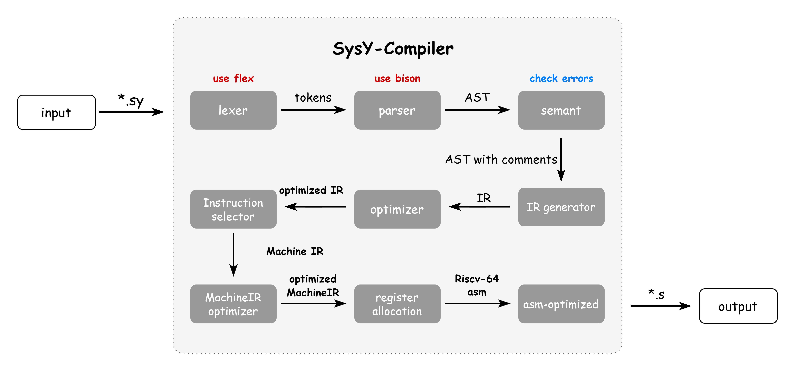

# SysY Compiler
#### SysY -> RISC-V 64bits GC_Zba_Zbb

## OverView

### Introduction to SysY (subset of C, but something different with C)

**supports int and float**

**supports array of any dimensions**

**supports while, for, if, else, break, continue**

```c
A[f()] += B[f()] is same as A[f()] = A[f()] + B[f()]
```

```c
//this expression below is valid
const int a = 5,b = 13
int Arr[a][b] = {} 
```

```c
//not support ++ operator
++i is same as +(+i) 
```

```c
//keyword of for loop is @for
//because SysY2022 does not have keyword "for", and we can define a variable named "for"
@for(int i=1;i<=10;i=i+1){}
```

you can see more details in **lexer/SysY_lexer.l** and **parser/SysY_parser.y**

### IO
see **lib/sylib.c** and **lib/sylib.h**

### Architecture of Compilers

you can see more details in 

## Prerequisites

Clang 15.0+

riscv64-unknown-linux-gnu-gcc 12.2+

qemu-riscv64 7.0+

flex 2.6+

bison 3.8+

## Build Steps
```bash
mkdir obj
mkdir bin
make -j
```

if you update parser(*.y), use the command below
```bash
make parser
make -j
```

if you update lexer(*.l), use the command below
```bash
make lexer
make -j
```


## Tests

To test **functional** testcases without optimization
```bash
## see SysY_test.sh for more details
./SysY_test.sh S 00 rv64gc
```

To test **functional** testcases with optimization
```bash
## see SysY_test.sh for more details
./SysY_test.sh S 01 rv64gc
```

To test **performance** testcases with optimization 
```bash
## see SysY_performance.sh for more details
./SysY_test_performance.sh S rv64gc
```

To generate asm of single file(*.sy) with optimization
```bash
## first put your inputfile in testcase/example
## then run the command below, outputfile is in test_output/example
## you can see SysY_test_single.sh for more details
./SysY_test_single.sh [filename] S O1  
```

## Mid-End Optimization

##### Analysis Pass
-ControlFlowGraph

-DomTree

-AliasAnalysis

-MemoryDependencyAnalysis

-LoopBasicInformation

-ScalarEvolution

-LoopCarriedDependencyAnalysis


##### TransForm Pass

-TailRecursiveElimination

-Mem2reg

-SparseConditionalConstantPropagation

-SimplifyCFG

-InstSimplify

-InstCombine

-AggressiveDeadCodeElimination

-CommonSubexpressionElimination

-DeadStoreElimination

-RedundantBranchElimination

-FunctionInline

-LoopSimplify

-LCSSA

-LoopInvariantCodeMotion

-LoopFullUnroll

-LoopIdomRecognize

-LoopFusion

-LoopParallel

-LoopStrengthReduce

-LoopUnroll

## Back-End Optimization
-MachinePeephole

-MachineCSE

-MachineLICM

-MachineInstructionSchedule

-RegisterCoalesce

-LinearScan

## Reference
https://github.com/llvm/llvm-project/blob/main/llvm/lib
